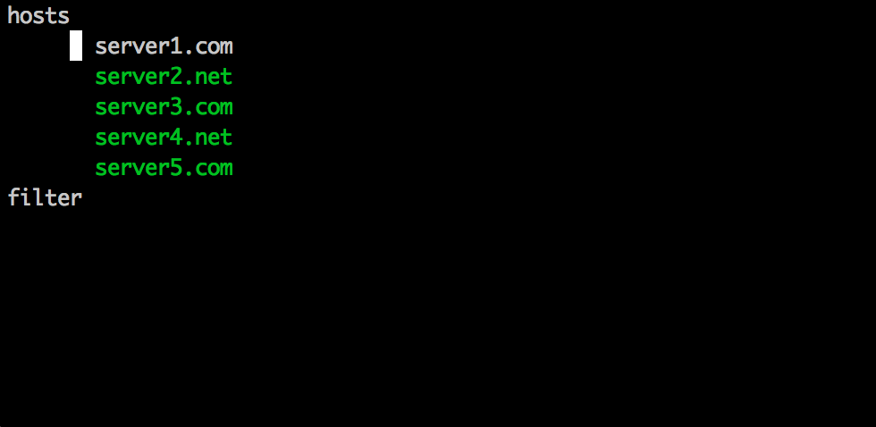
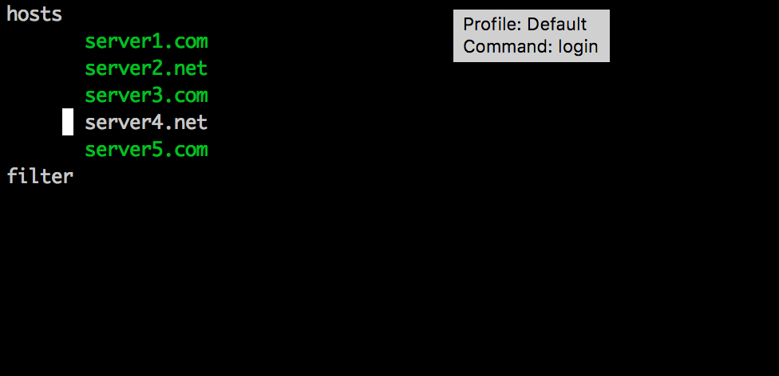
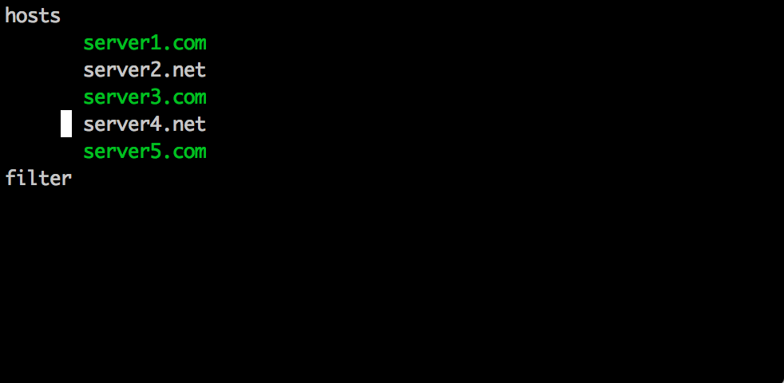
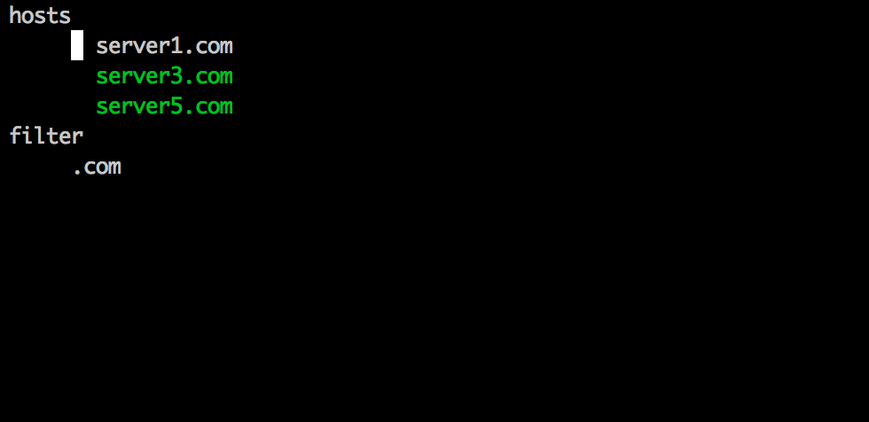
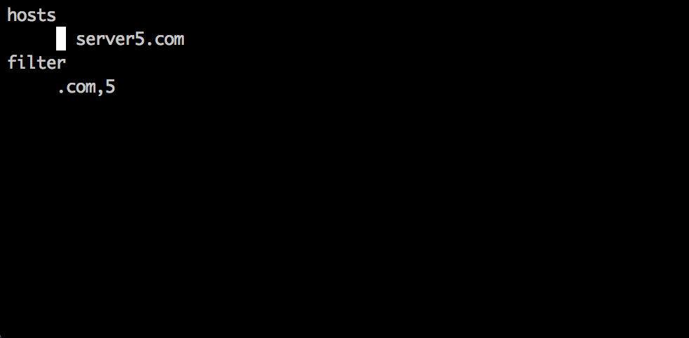

USSH
====

Description
===========
Ussh searches for servers using uptime.  If you select a server
from the menu it logs you into that server.

Install
=======

    git clone http://github.com/cswank/ussh
    cd ussh
    go install

Usage
=====

In order to use it you must set

    export USSH_USER=<your ldap username>

Also, this will read your ~/.chef/knife.rb file.  However, it won't
do the ruby string substitutions, so you will have to change

    client_key "#{home_dir}/.chef/somepem.pem"

to
    
    client_key "/Users/<username>/.chef/somepem.pem"

If you don't like the colors you can play witb the three
that are used by setting, for example:

    export USSH_COLOR_1=blue
    export USSH_COLOR_2=red
    export USSH_COLOR_3=magenta

The choices are black, red, green, yellow, blue, magenta,
cyan, and white.
  
Then type, for example

    ussh server

A menu will pop up that will contain all nodes with the word
'server' in their name.

Type 'p', 'n' (emacs style) or use the up and down arrows to
highlight a different node.

Hit the enter key to ssh to the highlighted node.  You can
select multiple nodes and cssh into all of them by using the
space bar to select.  So, to ssh into server2 and server 4 you
navigate to server1, hit space, navigate to server 4 and hit enter.

Another way to cssh to multiple nodes is to type C-a.  A cssh session
will then ssh into all visible nodes whether they are highlighted or
not.

You can also filter the result list down in a few ways.  One is to
type Control-f (C-f).  The cursor will move to the filter box.  After
you are done typing a filter term hit enter to move the cursor back to
the node list.

Search terms can be separated by a comma.  The filter terms will be
ANDed together.

Another way to get a more refined list of nodes is to use a --role
argument when starting ussh:

    ussh server --role teamA

In order to quit without logging into anything type control-d.

